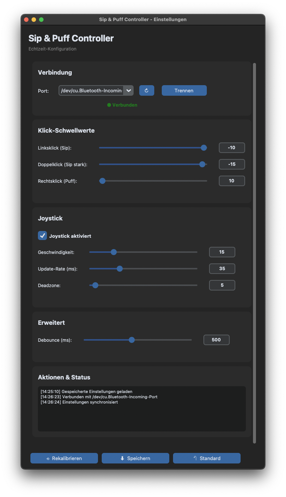
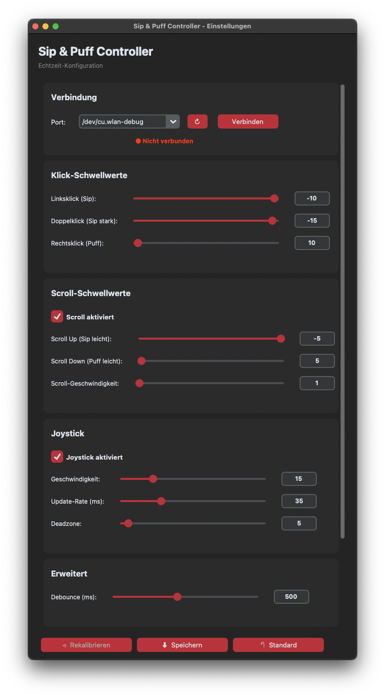

# Sip & Puff Mouse Controller

> Ein adaptives Eingabesystem für Menschen mit eingeschränkter Fingermotorik


---

## 📖 Über das Projekt

Dieses Projekt entstand im Rahmen eines **Human Factors (HF) Projekts** an der **Hochschule Furtwangen** und verfolgt die Fragestellung:

> **"Wie können durch eine Assistenzlösung zusätzliche, intuitiv nutzbare Freiheitsgrade geschaffen werden, die Menschen mit eingeschränkter Fingermotorik das selbstständige Ausführen der Maussteuerung ermöglichen?"**

### Definition Freiheitsgrad

*"Ein Freiheitsgrad ist eine (kontinuierliche) Dimension, die vom Eingabegerät erfasst und vom Benutzer unabhängig gesteuert werden kann."*  
— Seinfeld et al. (2020): User Representations in Human-Computer Interaction

---

## 🎯 Projektziele

Das System wurde entwickelt mit Fokus auf:

1. **Ausdrucksstarke Schnittstelle**  
   Maximaler digitaler Output bei minimalem physischem Aufwand

2. **Nutzerzentrierung**  
   Übertragbarkeit auf alle Menschen mit ähnlichen Einschränkungen

3. **Alltagsverbesserung**  
   Mehr Selbstständigkeit bei der PC-Bedienung für Menschen mit Einschränkungen

4. **Intuitive Bedienung**  
   Natürliche Interaktion durch Sip & Puff (Saug- und Blastechnik)

### Inspiration

Das Projekt orientiert sich an professionellen Assistenzsystemen wie dem **Quadstick** und ähnlichen kommerziellen Produkten, bietet aber eine **Open-Source-Alternative** zum Selbstbau.

---

## 🔄 Entwicklungsprozess & Prototypen

Die Entwicklung erfolgte iterativ in mehreren Prototyp-Versionen:

### Version 1.0 - Proof of Concept


**Features:**
- Basis-Funktionalität (Sip & Puff für Klicks)
- Joystick für 2D-Mausbewegung
- Lötverbindung der Komponenten
- Einfacher Arduino-Code

**Erkenntnisse:**
- Drucksensor-Kalibrierung essentiell
- Schwellwerte müssen anpassbar sein
- Deadzone notwendig für präzise Steuerung
- Geschwindigkeitsanpassung wichtig

### Version 2.0 - GUI-gesteuert


**Features:**
- Ersze vollständige GUI-Integration
- Echtzeit-Parameteranpassung
- Persistente Einstellungen
- Moderne CustomTkinter-UI

**Erkenntnisse:**
- Live-Anpassung drastisch verbessert Nutzbarkeit
- Individuelle Profile essentiell

---

## ✨ Features

### Hardware
- ✅ **MPXV7002DP Drucksensor** für bidirektionale Druckmessung (Saugen/Blasen)
- ✅ **Analoger Joystick** für präzise 2D-Mausbewegung
- ✅ **Arduino Pro Micro** als USB-HID-Gerät (native Mausfunktion)
- ✅ **Modularer Aufbau** für einfache Anpassungen

### Software
- ✅ **Moderne GUI** mit CustomTkinter für Echtzeit-Konfiguration
- ✅ **Live-Parameteranpassung** ohne Arduino-Neustart
- ✅ **Persistente Einstellungen** (JSON & Arduino EEPROM)
- ✅ **Drei Klick-Modi**: Linksklick, Doppelklick, Rechtsklick
- ✅ **Scroll-Funktionalität** für vertikales Scrollen
- ✅ **Adaptive Schwellwerte** (-400 bis +400)
- ✅ **Joystick aktivierbar/deaktivierbar**
- ✅ **Standalone Desktop-Anwendung** (.app/.exe) ohne Python-Installation



---

## 🛠️ Hardware-Komponenten

| Komponente | Typ | Funktion | Ungefähre Kosten | Link |
|------------|-----|----------|------------------|------|
| Arduino Pro Micro | ATmega32U4 | Mikrocontroller mit nativer USB-HID-Unterstützung | ~8 € | https://www.amazon.de/EntwicklungBoards-Binghe-Mikrocontroller-Entwicklungsboard-Selbst-USB-Updater/dp/B0D69JLJ97/ref=sr_1_1_pp?crid=3FBKSPF7ND7OH&dib=eyJ2IjoiMSJ9.m9zoZdlvH_p8LU9pMV4IJOJ5KPBbrCMNkZKKCmBEfpgtMUrJUq3ggsoOKdUmjuCV-_4V8o2hM9JqLgg1LsCxJrqLudyg19aJPjiBQp9CXK9PtmK0OKS_Sbb1JXT7yrYkMQuxoDDsUkRYc62Lx7b0D6K2BUTU9blUNgKt7_nZxJ8fxKc4lztovX7qqiIkRWlJ1ZIY5JQ4TXoqx5tw3sI0ED9u32NgMS9CbSdakyHV2js.hyoTs0gNzm_DUlIygOJR_kxBFjo83G-4MAdEWQnrUYg&dib_tag=se&keywords=arduino+pro+micro&qid=1765627500&sprefix=arduino+pro+%2Caps%2C114&sr=8-1 |
| MPXV7002DP | Drucksensor | Bidirektionaler Differenzdrucksensor (±2 kPa) | ~24 € | https://www.amazon.de/dp/B08D6JDJ4D?ref=ppx_yo2ov_dt_b_fed_asin_title |
| Analoger Joystick | 2-Achsen | XY-Achsen für Mausbewegung | ~1 € | https://www.roboter-bausatz.de/p/joystick-modul-2-achsen |
| Schlauch 2.5mm ID x 4mm OD x 1m | Silikon (Lebensmittelecht) | Für Sip & Puff Eingabe | ~4 € | https://www.amazon.de/dp/B0BZXR88VD?ref=ppx_yo2ov_dt_b_fed_asin_title&th=1 |
| Schlauch 3mm ID x 6mm OD x 1.5m | Silikon (Lebensmittelecht) | Für Sip & Puff Eingabe | ~5 € | https://www.amazon.de/dp/B0CXPW74GZ?ref=ppx_yo2ov_dt_b_fed_asin_title&th=1 |
| PTFE Filter | Hydrophob | Hygiene & Schutz gegen Flüssigkeit | ~14 € | https://www.amazon.de/dp/B07KWW7ZXF?ref=ppx_yo2ov_dt_b_fed_asin_title&th=1 |
| Luer Lock Adapter | Weiblich | Verbindung von Filter & Schlauch | ~7 € | https://www.amazon.de/dp/B0BMFJSJP1?ref=ppx_yo2ov_dt_b_fed_asin_title |
| Luer Lock Adapter | Männlich | Verbindung von Filter & Schlauch | ~8 € | https://www.amazon.de/dp/B0B8CJVX3S?ref=ppx_yo2ov_dt_b_fed_asin_title |
| Diverse | Kabel, LEDs, Gehäuse | Verkabelung und Montage | ~5-10 € |
| **Gesamt** | | | **~75-80 €** |

---

## 🔌 Schaltplan

### Pin-Belegung Arduino Pro Micro

```
MPXV7002DP Drucksensor:
├─ VCC  → 5V (Arduino)
├─ GND  → GND (Arduino)
└─ OUT  → A0 (Analog)

Joystick:
├─ VCC  → RAW (5V Arduino)
├─ GND  → GND (Arduino, optional über Kippschalter)
├─ VRx  → A2 (Analog)
└─ VRy  → A1 (Analog)

Reset-Button:
├─ Pin 1 → GND
└─ Pin 2 → RST
```

---

## 📦 Installation

### Voraussetzungen

**Hardware:**
- Arduino Pro Micro (oder kompatibel)
- USB-Kabel (Micro-USB)
- Aufgebaute Schaltung (siehe Schaltplan)

**Software:**
- [PlatformIO](https://platformio.org/) oder Arduino IDE
- Python 3.7+ (für GUI-Entwicklung, nicht für fertige Desktop-App)
- Git (optional)

### 1. Repository klonen

```bash
git clone https://github.com/robinoraptor/sip-puff-controller.git
cd sip-puff-controller
```

### 2. Arduino-Code flashen

#### Mit PlatformIO (empfohlen):

```bash
cd arduino/
pio run --target upload
```

#### Mit Arduino IDE:
1. `arduino/src/main.cpp` öffnen
2. Board auswählen: **Tools → Board → SparkFun Pro Micro (5V, 16 MHz)**
3. Port auswählen: **Tools → Port → [Dein Port]**
4. Hochladen: **Sketch → Upload**

### 3. GUI verwenden

Du hast zwei Optionen:

#### Option A: Fertige Desktop-Anwendung (empfohlen für Endnutzer)

**Vorteil:** Keine Python-Installation nötig!

1. Lade die fertige `.app` (Mac) oder `.exe` (Windows) herunter
2. Doppelklick zum Starten
3. Fertig! 🎉

**Oder erstelle sie selbst** (siehe [Desktop-Anwendung erstellen](#desktop-anwendung-erstellen))

#### Option B: Python-Version (für Entwickler)

**Automatisch:**

**Linux/macOS:**
```bash
cd gui/
./start_gui.sh
```

**Windows:**
```bash
cd gui/
start_gui.bat
```

**Manuell:**

```bash
cd gui/
pip install -r requirements.txt
python sippuff_gui.py
```

---

## 🖥️ Desktop-Anwendung erstellen

Du möchtest die GUI als **standalone .app/.exe** verteilen, ohne dass Python installiert sein muss?

### Voraussetzungen

```bash
cd gui/
pip install -r requirements.txt
```

Das installiert automatisch auch PyInstaller.

### Build-Prozess

#### macOS (.app):

```bash
cd gui/

# Build-Script ausführbar machen (nur einmal nötig)
chmod +x build_mac_linux.sh

# Desktop-App erstellen
./build_mac_linux.sh
```

**Ergebnis:** `dist/SipPuffController.app` (~90-130 MB)

#### Windows (.exe):

```cmd
cd gui

:: Desktop-App erstellen
build_windows.bat
```

**Ergebnis:** `dist\SipPuffController.exe` (~80-120 MB)

#### Linux (Binary):

```bash
cd gui/

# Build-Script ausführbar machen (nur einmal nötig)
chmod +x build_mac_linux.sh

# Desktop-App erstellen
./build_mac_linux.sh
```

**Ergebnis:** `dist/SipPuffController` (~90-130 MB)

### Die fertige Anwendung

Nach dem Build findest du die Anwendung in `gui/dist/`:

```
gui/
├── dist/
│   └── SipPuffController.app    (Mac)
│       SipPuffController.exe    (Windows)
│       SipPuffController        (Linux)
└── build/                        (temporäre Dateien)
```

**Die Anwendung enthält:**
- ✅ Python Runtime
- ✅ Alle Bibliotheken (CustomTkinter, PySerial, etc.)
- ✅ GUI-Code
- ✅ Theme-Dateien
- ✅ Komplettes System in einer Datei!

### Verteilen

**Einfach die .app/.exe kopieren und weitergeben!**

Keine Installation nötig, einfach:
1. Kopieren auf anderen Computer
2. Doppelklick
3. Arduino anschließen
4. Fertig! 🚀

### Wichtige Hinweise

**macOS:**
- Beim ersten Start: Rechtsklick → "Öffnen" (wegen Gatekeeper)
- Oder: Systemeinstellungen → Sicherheit → "Trotzdem öffnen"

**Windows:**
- Antivirus könnte Warnung zeigen (False Positive)
- "Weitere Informationen" → "Trotzdem ausführen"

**Linux:**
- Ausführbar machen: `chmod +x SipPuffController`
- Dann starten: `./SipPuffController`

### Build bereinigen

```bash
# Alte Builds löschen
cd gui/
rm -rf dist/ build/ *.spec

# Neu builden
./build_mac_linux.sh  # oder build_windows.bat
```

---

## 🚀 Verwendung

### Ersteinrichtung

1. **Arduino anschließen**
   - System kalibriert automatisch beim Start
   - ⚠️ **Wichtig:** NICHT in den Schlauch pusten/saugen während der Kalibrierung!

2. **GUI starten**
   - Desktop-App: Doppelklick auf `.app`/`.exe`
   - Oder: `python sippuff_gui.py`

3. **Verbinden**
   - Port auswählen (z.B. COM3 oder /dev/ttyACM0)
   - "Verbinden" klicken
   - GUI lädt automatisch die Arduino-Einstellungen

4. **Einstellungen anpassen**
   - Mit Slidern experimentieren
   - Echtzeit-Feedback im Log
   - Drucktest nutzen für optimale Schwellwerte

#### Standard-Belegung:

| Aktion | Eingabe | Beschreibung |
|--------|---------|--------------|
| **Linksklick** | Puff (Blasen) > 10 | Leichtes Blasen |
| **Doppelklick** | Puff (Blasen) > 15 | Kräftiges Blasen |
| **Rechtsklick** | Sip (Saugen) < -10 | Leichtes Ansaugen |
| **Scroll Up** | Sip (Saugen) < -5 | Sehr leichtes Ansaugen |
| **Scroll Down** | Puff (Blasen) > 5 | Sehr leichtes Blasen |
| **Mausbewegung** | Joystick | 2D-Bewegung in alle Richtungen |

#### Anpassbare Parameter:

**Klick-Schwellwerte:**
- Linksklick (Puff): 0 bis 400
- Doppelklick (Puff): 0 bis 400
- Rechtsklick (Sip): -400 bis 0

**Scroll-Schwellwerte:**
- Scroll Up (Sip): -400 bis 0
- Scroll Down (Puff): 0 bis 400
- Scroll-Geschwindigkeit: 1-5

**Joystick:**
- Geschwindigkeit: 5-50
- Update-Rate: 10-100ms
- Deadzone: 0-100

**Weitere:**
- Debounce: 100-1000ms
- Joystick an/aus
- Scroll an/aus

### Einstellungen speichern

**Auf PC speichern:**
- Klicke "⬇ Auf PC speichern"
- Wird in `~/.sippuff/sippuff_config.json` gespeichert
- Funktioniert auch in Desktop-App!

**Auf Arduino speichern:**
- Klicke "💾 Auf Arduino speichern"
- Wird im Arduino EEPROM gespeichert
- Arduino funktioniert jetzt **Plug & Play** - auch ohne PC!
- Einstellungen bleiben dauerhaft erhalten

**Standard wiederherstellen:**
- Klicke "↶ Standard"
- Lädt Standardwerte aus `sippuff_defaults.json`

### Workflow: Arduino als Master

Das System ist so konzipiert, dass **der Arduino die Einstellungen speichert**:

```
1. Arduino anschließen
2. GUI öffnen → Verbinden
3. GUI lädt automatisch Arduino-Einstellungen ✅
4. In GUI anpassen (optional)
5. "💾 Auf Arduino speichern" (optional)
6. Beim nächsten Start: Arduino hat alles gespeichert!
```

**Vorteil:** Arduino funktioniert überall gleich - egal an welchem PC!

---

## 🔧 Konfiguration

### Schwellwerte anpassen

Die Empfindlichkeit kann individuell angepasst werden:

```
Für Nutzer mit schwächerer Atemkontrolle:
├─ Linksklick (Puff): 5
├─ Doppelklick (Puff): 8
├─ Rechtsklick (Sip): -5
├─ Scroll Down (Puff): 3
└─ Scroll Up (Sip): -3

Für Nutzer mit stärkerer Atemkontrolle:
├─ Linksklick (Puff): 30
├─ Doppelklick (Puff): 50
├─ Rechtsklick (Sip): -30
├─ Scroll Down (Puff): 10
└─ Scroll Up (Sip): -10
```

**Tipp:** Nutze den **Drucktest** in der GUI, um deine optimalen Werte zu finden!

### Standard-Werte ändern

Editiere `~/.sippuff/sippuff_defaults.json`:

```json
{
  "click_left": 10,
  "click_double": 15,
  "click_right": -10,
  "scroll_up": -5,
  "scroll_down": 5,
  "scroll_speed": 1,
  "scroll_enabled": true,
  "wavelength": 15,
  "period": 35,
  "deadzone": 25,
  "debounce": 500,
  "joystick_enabled": true
}
```

---

## 🔬 Technische Details

### Arduino-Firmware

- **Sprache:** C++ (Arduino Framework)
- **Bibliotheken:** `Mouse.h` (native USB-HID), `EEPROM.h`
- **Sampling-Rate:** 100 Hz (10ms Loop)
- **Kalibrierung:** Automatisch beim Start (50 Samples, 1 Sekunde)
- **Serial-Protokoll:** 115200 Baud für GUI-Kommunikation
- **Persistenz:** EEPROM-Speicher für Plug & Play Betrieb

### GUI-Anwendung

- **Framework:** CustomTkinter (moderne UI)
- **Kommunikation:** PySerial
- **Architektur:** Event-driven mit Threading
- **Build-System:** PyInstaller für standalone Apps
- **Config-Speicher:** `~/.sippuff/` (User-Home-Directory)
- **Plattformen:** Windows, macOS, Linux

### Desktop-App Details

**PyInstaller-Build:**
- `--onefile`: Einzelne ausführbare Datei
- `--windowed`: Keine Konsole (nur GUI)
- `--add-data`: Theme-Dateien eingebettet
- Alle Abhängigkeiten inkludiert
- Keine Python-Installation erforderlich

**Dateigröße:**
- Mac: ~90-130 MB (.app Bundle)
- Windows: ~80-120 MB (.exe)
- Linux: ~90-130 MB (Binary)

---

## 📚 Wissenschaftlicher Hintergrund

### Literatur

**Seinfeld, S., Feuchtner, T., Maselli, A. & Müller, J. (2020).**  
*User Representations in Human-Computer Interaction.*  
Human-Computer Interaction, 36(5–6), 400–438.  
https://doi.org/10.1080/07370024.2020.1724790

### Verwandte Projekte

- **Quadstick** - Kommerzielles Sip & Puff System
- **Xbox Adaptive Controller** - Microsoft's Adaptive Gaming Controller

---

## ⚠️ Sicherheitshinweise

### Wichtig für die Nutzung:

1. **Hygiene**
   - Mundstück täglich reinigen/desinfizieren
   - Schlauch regelmäßig austauschen
   - Bei mehreren Nutzern: individuelle Mundstücke verwenden

2. **Gesundheit**
   - Bei Schwindel/Unwohlsein sofort pausieren
   - Nicht zu stark/häufig pusten (Hyperventilation vermeiden)
   - Regelmäßige Pausen einlegen

3. **Technisch**
   - System nicht unbeaufsichtigt mit anderen Nutzern betreiben
   - Bei Fehlfunktion sofort vom Computer trennen
   - Keine Modifikationen an medizinischen Komponenten

4. **Medizinisch**
   - Dieses System ist **kein medizinisches Produkt**
   - Keine CE-Kennzeichnung für Medizinprodukte
   - Bei medizinischer Nutzung: Rücksprache mit Fachpersonal

---

## 🎓 Hochschule Furtwangen

Entwickelt im Rahmen eines Human Factors Projekts an der **Hochschule Furtwangen University (HFU)**.

**Fakultät:** Engineering Technology  
**Studiengang:** Human Factors  
**Semester:** 2. Semester

---

## 📄 Lizenz

Dieses Projekt steht unter der MIT-Lizenz - siehe [LICENSE](LICENSE) für Details.

---

## 🤝 Beitragen

Contributions sind willkommen! Bitte öffne ein Issue oder Pull Request auf GitHub.

---

## 📧 Kontakt

Bei Fragen oder Anregungen:
- GitHub Issues: [github.com/robinoraptor/sip-puff-controller/issues](https://github.com/robinoraptor/sip-puff-controller/issues)
- Email: [Deine Email]

---

**Entwickelt mit ❤️ für mehr Barrierefreiheit**
